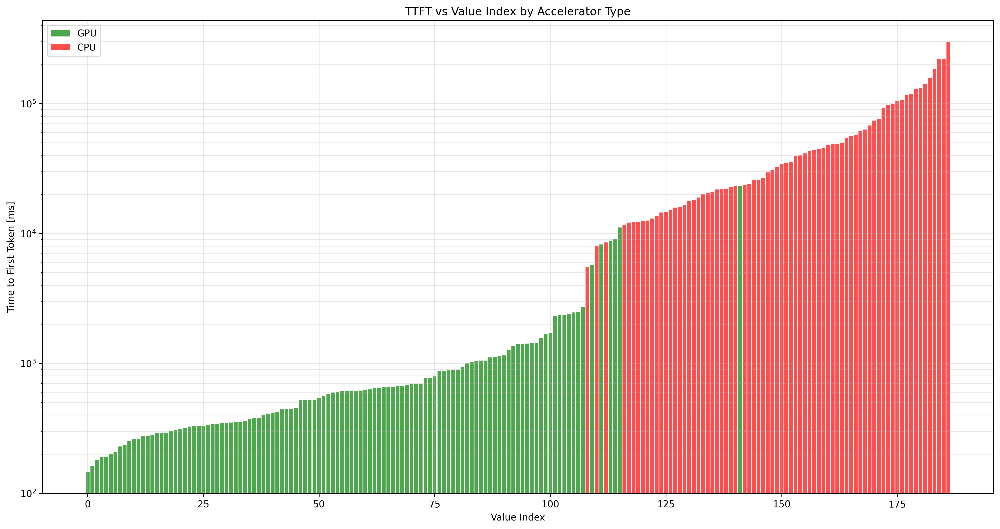
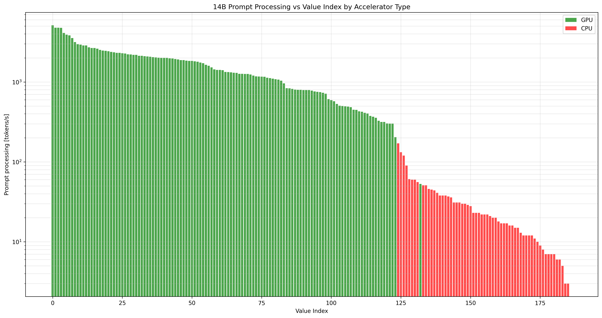
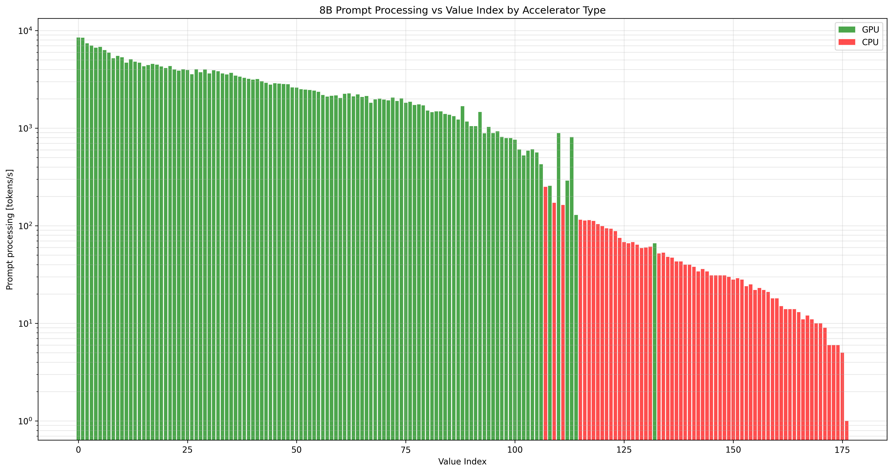
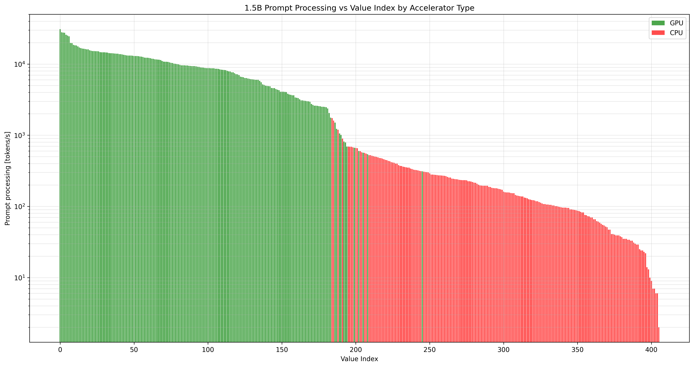

# LocalScore leaderboard insights

LocalScore leaderboard: [LocalScore](https://www.localscore.ai/latest)

All benchmark results: [localscore_leaderboard.csv](localscore_leaderboard.csv) (Currently 1218 in total.)

## Time to first token

Performance is primarily determined by the memory bandwidth of the GPU/CPU. GPUs have an order of magnitude larger memory bandwidth. A few GPUs' VRAM is almost as slow as CPUs' system RAM.

### 14 B parameter model

The figure below shows the benchmark results for the 14 B parameter model, ordered by time-to-first-token values. GPUs: 146 to 2720 ms (~19x span). CPUs: 5560 to 298,080 ms (~54x span; 1 outlier removed from the data).  \
Data: [localscore_leaderboard.q4_k_med.14B.sorted_by_ttft.csv](localscore_leaderboard.q4_k_med.14B.sorted_by_ttft.csv)

## Prompt processing

Prompt processing is primarily determined by the processing units' tensor multiplication-and-add throughput. GPUs have more processing units -- especially dedicated tensor cores -- this contributes the most to the overall performance. CPUs in general do not have sufficient number of cores to parallelize the computation.

### 14 B parameter model

Prompt processing throughput for the 14 B parameter model. GPUs: 5126 down to 204 tokens/s (~25x span). CPUs: 171 to 3 tokens/s (~57x span). \
Data: [localscore_leaderboard.q4_k_med.14B.sorted_by_pp_tps.csv](localscore_leaderboard.q4_k_med.14B.sorted_by_pp_tps.csv)

### 8 B parameter model

Prompt processing throughput for the 8 B parameter model. GPUs: 8479 down to 427 tokens/s (~20x span). CPUs: 250 to 1 token/s. \
Data: [localscore_leaderboard.q4_k_med.8B.llama3.1.sorted_by_pp_tps.csv](localscore_leaderboard.q4_k_med.8B.llama3.1.sorted_by_pp_tps.csv)

### 1.5 B parameter model

Prompt processing throughput for the 1.5 B parameter model. GPUs: 30,896 down to 1470 tokens/s (~20x span). CPUs: 1738 to 2 tokens/s. \
Data: [localscore_leaderboard.q4_k_med.1.5B.sorted_by_pp_tps.csv](localscore_leaderboard.q4_k_med.1.5B.sorted_by_pp_tps.csv)

## Observations

### GPUs

These are the best GPUs:

-   NVIDIA RTX PRO 6000 Blackwell Workstation Edition 95 GB
-   NVIDIA RTX 6000 Ada Generation 47 GB
-   NVIDIA GeForce RTX 5090 31 GB
-   NVIDIA GeForce RTX 4090 24 GB
-   NVIDIA GeForce RTX 4090 D 47 GB
-   NVIDIA RTX 6000 Ada Generation 48 GB

The following GPUs are good value and perform really well:

-   NVIDIA GeForce RTX 5070 Ti 15 GB
-   NVIDIA GeForce RTX 4080 SUPER 16 GB
-   NVIDIA GeForce RTX 4070 Ti SUPER 16 GB
-   NVIDIA GeForce RTX 4070 Ti 12 GB
-   NVIDIA GeForce RTX 3090 Ti 24 GB
-   NVIDIA GeForce RTX 3090 24 GB
-   NVIDIA GeForce RTX 3080 Ti 12 GB

There are only a few AMD GPUs which show notable performance in the current benchmarks:

-   AMD Radeon RX 6900 XT 16 GB
-   AMD Radeon PRO V620 30 GB
-   AMD Radeon RX 7900 XTX 24 GB
-   AMD Radeon RX 6800 XT 16 GB
-   AMD Radeon RX 6700 XT 12 GB
-   AMD Radeon RX 6650 XT 8 GB
-   AMD Radeon RX 9070 XT 16 GB
-   AMD Radeon RX 7800 XT 16 GB
-   AMD Radeon RX 6600 8 GB

### CPUs

Some processors can approach the performance of weaker GPUs:

-   AMD Ryzen Threadripper PRO 7995WX (znver4)
-   AMD EPYC 9454P 48-Core Processor (znver4)
-   AMD Ryzen 9 9950X 16-Core Processor
-   AMD Ryzen 9 7950X3D 16-Core Processor (znver4)
-   AMD Ryzen 9 9950X3D 16-Core Processor
-   AMD Ryzen 9 7950X 16-Core Processor (znver4)

Note that even these processors are an order of magnitude slower at prompt processing than the average GPU.

### Hybrid system

The benchmark results show a hybrid system, too. [Test #337](https://www.localscore.ai/result/337) features an AMD Ryzen 7 7800X3D 8-Core Processor (znver4) with 32 GB of system RAM, plus an NVIDIA GeForce RTX 4060 Ti with 8 GB VRAM. The model under test is Qwen2.5 14B Instruct Q4_K - Medium with 14.8B parameters. The file size is 8,988,110,976 bytes, which does not fit into the GPU memory.

The results are shown in the following table:

| TEST NAME      | PROMPT (tokens/s) | GENERATION (tokens/s) | TTFT       |
|----------------|------------------:|----------------------:|------------|
| pp1024+tg16    |               136 |                   3.9 | 7.82 sec   |
| pp4096+tg256   |                86 |                   2.9 | 47.96 sec  |
| pp2048+tg256   |               545 |                   3.6 | 4.03 sec   |
| pp2048+tg768   |               527 |                   3.4 | 4.17 sec   |
| pp1024+tg1024  |               538 |                   3.6 | 2.18 sec   |
| pp1280+tg3072  |               426 |                   3.0 | 3.33 sec   |
| pp384+tg1152   |               430 |                   3.7 | 1.22 sec   |
| pp64+tg1024    |               205 |                   3.8 | 578 ms     |
| pp16+tg1536    |                49 |                   3.6 | 606 ms     |

[Test #320](https://www.localscore.ai/result/320) runs the same model on the same system, but this time without the GPU. Only the CPU is used for prompt processing and token generation. The results are shown below:

| TEST NAME      | PROMPT (tokens/s) | GENERATION (tokens/s) | TTFT      |
|----------------|------------------:|----------------------:|-----------|
| pp1024+tg16    |               38  |                  5.8  | 27.08 sec |
| pp4096+tg256   |               34  |                  5.1  | 120.12 sec|
| pp2048+tg256   |               40  |                  5.6  | 52.01 sec |
| pp2048+tg768   |               39  |                  5.5  | 52.12 sec |
| pp1024+tg1024  |               41  |                  5.7  | 25.01 sec |
| pp1280+tg3072  |               39  |                  5.4  | 32.66 sec |
| pp384+tg1152   |               40  |                  5.8  | 9.74 sec  |
| pp64+tg1024    |               37  |                  5.9  | 1.87 sec  |
| pp16+tg1536    |               32  |                  5.8  | 670 ms    |

In the case of the hybrid GPU+CPU setup, the prompt processing throughput varies between 49 and 545 tokens/s, mostly around 200–500 tokens/s. The time to first token falls between 578 ms and 7.82 seconds -- the only exception is the simulated RAG operation (pp4096+tg256), in which case it takes 47.96 sec to generate the first token. The output is generated at a rate of 3–4 tokens/s.

In the CPU-only case, the prompt processing throughput is uniformly around 30–40 tokens/s. The time to get the first token depends on the length of the input, ranging from 670 ms to 52.12 seconds. Again, the notable exception is the (pp4096+tg256) case, which takes 120.12 seconds to produce the first token. The CPU-only method takes 8–12 times more time to generate the first token (with the exception of pp4096+tg256, which takes 2.5 times as long).

The situation is reversed for token generation. The CPU-only method produces output at a rate of 5-6 tokens/s -- around 1.6 faster than the GPU+CPU method.

The slow token generation of the GPU+CPU method may be attributed to the extra time needed to move the model weights from the system RAM into the VRAM again and again for each generated token. For prompt processing, the required time is determined by the size of the input prompt and dominated by the computational demand rather than the memory bandwidth.

In conclusion, a GPU with even a small amount of VRAM can contribute positively to the overall system performance.
