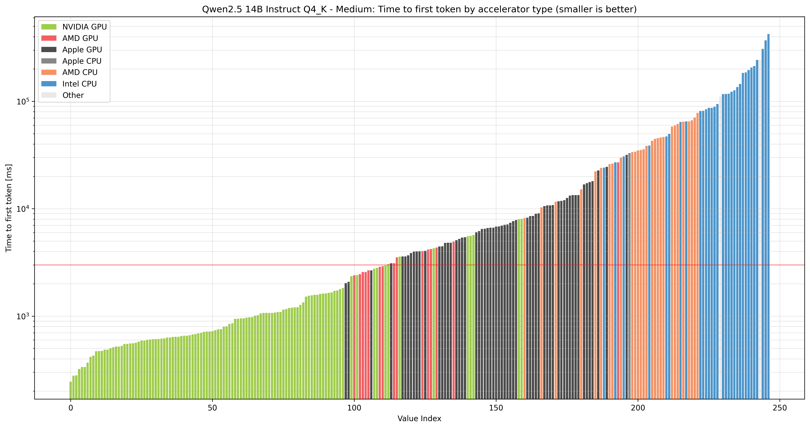
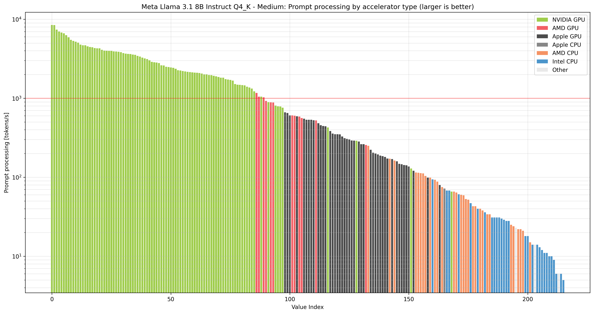
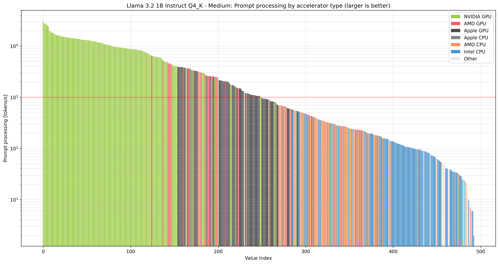

# LocalScore insights

[LocalScore](https://www.localscore.ai/latest) is a benchmarking tool to measure how fast Large Language Models run on a specific hardware.

The benchmark results are [downloaded](localscore_download_results.bat) and [concatenated](html_to_tsv.py) into a single table: [localscore_results.tsv](localscore_results.tsv) As of 2025.07.14 13:28:00, it contains 1218 results.

We examined 3 models:
-   [Qwen2.5 14B Instruct Q4_K - Medium](https://huggingface.co/bartowski/Qwen2.5-14B-Instruct-GGUF/resolve/main/Qwen2.5-14B-Instruct-Q4_K_M.gguf): 14B parameters, ~10GB memory.
-   [Meta Llama 3.1 8B Instruct Q4_K - Medium](https://huggingface.co/bartowski/Meta-Llama-3.1-8B-Instruct-GGUF/resolve/main/Meta-Llama-3.1-8B-Instruct-Q4_K_M.gguf): 8B parameters, ~6GB memory.
-   [Llama 3.2 1B Instruct Q4_K - Medium](https://huggingface.co/bartowski/Llama-3.2-1B-Instruct-GGUF/resolve/main/Llama-3.2-1B-Instruct-Q4_K_M.gguf): 1B parameters, ~2GB memory.

The insights are [compiled](create_charts.py) into the following charts.

## Summary of observations

-   For prompt processing: (14B parameter model, ttft < 3 seconds / prompt_tps > 1400 tokens/s):
    -   The majority of NVIDIA GPUs produce the first token within 3 seconds (~1400 token/s), even for the 14B parameter model.
    -   AMD GPUs perform consistently, albeit at the level of low-end NVIDIA GPUs.
    -   Some Apple GPUs (M3 Ultra, M4 Max) are on par with AMD GPUs, but the majority of Apple GPUs are in the performance range of AMD CPUs.
    -   AMD CPUs perform poorly in prompt processing, mostly below the performance of Apple GPUs.
    -   Intel CPUs are 10x slower than Apple GPUs, and 100x slower than NVIDIA GPUs.

-   For token generation: (14B parameter model, gen_tps > 10 tokens/s):
    -   All NVIDIA GPUs and AMD GPUs produce output at a rate of at least 10 tokens/s.
    -   The majority of Apple GPUs generate tokens above 10 tokens/s.
    -   The AMD EPYC 9135 16-Core and the AMD EPYC 9454P 48-Core with (12-channel) 256GB RAM achieve around 26 and 21 tokens/s respectively, surpassing capable NVIDIA and AMD GPUs.
    -   Most of the AMD CPUs and Intel CPUs perform poorly, below 10 tokens/s. (Only for the 1B model can they produce output above 10 tokens/s.)

## Time to first token

Prompt processing and the time to produce the first token is primarily determined by the processing units' tensor multiplication-and-add throughput. GPUs have more processing units -- especially dedicated tensor cores -- this contributes the most to the overall performance. CPUs in general do not have sufficient number of cores to parallelize the computation.

### 14B parameter model: Qwen2.5 14B Instruct Q4_K - Medium

Data: [localscore.ttft.14B.tsv](localscore.ttft.14B.tsv)



The figure shows the time-to-first-token benchmark results for the 14 B parameter model. In the charts a threshold of 3 seconds was chosen arbitrarily as an upper limit for good performance for creating the first token. (Indicated by a red line.)

-   NVIDIA GPUs (<span style="color:#76b900;">&#9632;</span>): 146 to 1830 ms, with older/less performant ones into the 8 s range.
-   Apple GPUs  (<span style="color:#000000;">&#9632;</span>): 2029 ms to 20 seconds, with a few into the 30 seconds range.
-   AMD GPUs    (<span style="color:#ed1c24;">&#9632;</span>): 2.4 to 5 seconds. (Plus a poorly performing outlier at 27 seconds.)
-   AMD CPUs    (<span style="color:#f26522;">&#9632;</span>): 8.3 to 78 seconds, with the majority above 20 seconds.
-   Intel CPUs  (<span style="color:#0068b5;">&#9632;</span>): 24 seconds to 7 minutes, with the majority above 1.5 minutes.
-   All other hardware performed poorly.

The Apple GPUs seem to aim to fill the gap between the performance of NVIDIA GPUs and AMD CPUs.

-   Best performing NVIDIA GPUs: \
    `cat localscore.ttft.14B.tsv | grep "NVIDIA GPU" | awk -F"\t" "!seen[$12]++" | cut -f4,12`

    -   Top performers (ttft < 500 ms):
        | ttft [ms] | accel_name                                         | VRAM [GB] |
        |-----------|----------------------------------------------------|----------:|
        | 245       | NVIDIA RTX PRO 6000 Blackwell Workstation Edition  | 95.0      |
        | 279       | NVIDIA GeForce RTX 5090                            | 31.0      |
        | 322       | NVIDIA GeForce RTX 4090                            | 24.0      |
        | 336       | NVIDIA GeForce RTX 4090 D                          | 47.0      |
        | 369       | NVIDIA RTX 6000 Ada Generation                     | 47.0      |
        | 417       | NVIDIA H100 PCIe                                   | 79.0      |
        | 475       | NVIDIA H100 80GB HBM3                              | 79.0      |
        | 488       | NVIDIA GeForce RTX 4080                            | 16.0      |
        | 488       | NVIDIA L40S                                        | 45.0      |

    -   Mid-tier NVIDIA GPUs (500 ms <= ttft < 2 seconds):
        | ttft [ms] | accel_name                                   | VRAM [GB] |
        |-----------|----------------------------------------------|----------:|
        | 513       | NVIDIA L40                                   | 44.0      |
        | 521       | NVIDIA GeForce RTX 4070 Ti SUPER             | 16.0      |
        | 529       | NVIDIA H100 NVL                              | 93.0      |
        | 552       | NVIDIA GeForce RTX 3090 Ti                   | 24.0      |
        | 555       | NVIDIA GeForce RTX 4080 SUPER                | 16.0      |
        | 558       | NVIDIA GeForce RTX 5080                      | 15.0      |
        | 578       | NVIDIA GeForce RTX 3090                      | 24.0      |
        | 592       | NVIDIA A100-SXM4-80GB                        | 79.0      |
        | 609       | NVIDIA GeForce RTX 4070 Ti                   | 12.0      |
        | 617       | NVIDIA GeForce RTX 3080 Ti                   | 12.0      |
        | 665       | NVIDIA GeForce RTX 4070 SUPER                | 12.0      |
        | 692       | NVIDIA RTX A6000                             | 48.0      |
        | 713       | NVIDIA A40                                   | 44.0      |
        | 752       | NVIDIA GeForce RTX 4070                      | 12.0      |
        | 802       | NVIDIA GeForce RTX 3080                      | 10.0      |
        | 846       | NVIDIA RTX A5000                             | 24.0      |
        | 859       | NVIDIA GeForce RTX 5070 Ti                   | 15.0      |
        | 944       | NVIDIA GeForce RTX 5060 Ti                   | 15.0      |
        | 952       | NVIDIA RTX 4000 Ada Generation               | 20.0      |
        | 954       | NVIDIA A100 80GB PCIe                        | 79.0      |
        | 968       | NVIDIA RTX 3500 Ada Generation Laptop GPU    | 12.0      |
        | 979       | NVIDIA RTX A4500                             | 20.0      |
        | 1020      | Tesla V100-SXM2-32GB                         | 32.0      |
        | 1060      | Quadro RTX 8000                              | 47.0      |
        | 1070      | NVIDIA GeForce RTX 4060 Ti                   | 16.0      |
        | 1070      | NVIDIA GeForce RTX 5070                      | 12.0      |
        | 1070      | NVIDIA GeForce RTX 2080 Ti                   | 11.0      |
        | 1160      | NVIDIA A10                                   | 22.0      |
        | 1190      | NVIDIA RTX A4000                             | 16.0      |
        | 1210      | NVIDIA TITAN V                               | 12.0      |
        | 1210      | NVIDIA L4                                    | 22.0      |
        | 1340      | NVIDIA RTX 4000 SFF Ada Generation           | 20.0      |
        | 1520      | NVIDIA GeForce RTX 3080 Laptop GPU           | 16.0      |
        | 1550      | NVIDIA RTX A5000 Laptop GPU                  | 16.0      |
        | 1560      | NVIDIA GeForce RTX 3060                      | 12.0      |
        | 1790      | NVIDIA RTX 2000 Ada Generation               | 16.0      |

    -   NVIDIA GPUs on par with other hardware:
        | ttft [ms] | accel_name                      | VRAM [GB] |
        |-----------|---------------------------------|----------:|
        | 2410      | NVIDIA RTX A2000 12GB           | 12.0      |
        | 2760      | Tesla T4                        | 15.0      |
        | 2820      | NVIDIA GeForce GTX 1080 Ti      | 11.0      |
        | 4280      | Quadro P5000                    | 16.0      |
        | 5550      | NVIDIA GeForce RTX 3060 Ti      | 8.0       |
        | 5710      | Tesla P100-SXM2-16GB            | 16.0      |
        | 8070      | NVIDIA GeForce RTX 3070         | 8.0       |

-   Top Apple GPUs: \
    `cat localscore.ttft.14B.tsv | grep "Apple GPU" | awk -F"\t" "!seen[$12]++" | cut -f4,12,14`

    | ttft [ms] | accel_name                      | VRAM [GB] |
    |-----------|---------------------------------|----------:|
    | 2029      | Apple M3 Ultra 24P+8E+80GPU     | 512.0     |
    | 2670      | Apple M3 Ultra 20P+8E+60GPU     | 96.0      |
    | 3100      | Apple M1 Ultra 16P+4E+64GPU     | 128.0     |
    | 3590      | Apple M4 Max 12P+4E+40GPU       | 128.0     |
    | 4030      | Apple M1 Ultra 16P+4E+48GPU     | 128.0     |
    | 4450      | Apple M4 Max 10P+4E+32GPU       | 36.0      |
    | 4800      | Apple M2 Max 8P+4E+38GPU        | 96.0      |

-   Top AMD GPUs: \
    `cat localscore.ttft.14B.tsv | grep "AMD GPU" | awk -F"\t" "!seen[$12]++" | cut -f4,12,14`

    | ttft [ms] | accel_name                      | VRAM [GB] |
    |-----------|---------------------------------|----------:|
    | 2400      | AMD Radeon RX 6900 XT           | 16.0      |
    | 2570      | Radeon RX 7900 XTX              | 24.0      |
    | 2670      | AMD Radeon RX 7900 XTX          | 24.0      |
    | 2880      | AMD Radeon RX 6800 XT           | 16.0      |
    | 3530      | AMD Radeon RX 6800              | 16.0      |
    | 4160      | AMD  Radeon RX 7800 XT          | 16.0      |
    | 4220      | AMD Radeon RX 7800 XT           | 16.0      |
    | 4940      | AMD Radeon RX 6700 XT           | 12.0      |

-   AMD CPUs producing the first token in less than 30 seconds: (high above threshold) \
    `cat localscore.ttft.14B.tsv | grep "AMD CPU" | awk -F"\t" "!seen[$12]++" | cut -f4,12,14`

    | ttft [ms] | accel_name                                             | VRAM [GB] |
    |-----------|--------------------------------------------------------|----------:|
    |  8170     | AMD EPYC 9454P 48-Core Processor (znver4)              | 251.4     |
    | 10270     | AMD EPYC 9135 16-Core Processor                        | 251.3     |
    | 11600     | AMD Ryzen 9 9950X3D 16-Core Processor                  | 92.0      |
    | 15140     | AMD Ryzen 9 7950X3D 16-Core Processor (znver4)         | 61.9      |
    | 22240     | AMD Ryzen Threadripper 3960X 24-Core Processor (znver2)| 62.7      |
    | 23990     | AMD Ryzen 9 5950X 16-Core Processor (znver3)           | 125.7     |
    | 26010     | AMD Ryzen 9 7945HX with Radeon Graphics (znver4)       | 23.3      |
    | 26300     | AMD Ryzen AI 9 HX 370 w/ Radeon 890M                   | 26.5      |
    | 29880     | AMD Ryzen 7 7800X3D 8-Core Processor (znver4)          | 62.3      |

-   Intel CPUs producing the first token in less than 1 minute: (high above threshold) \
    `cat localscore.ttft.14B.tsv | grep "Intel CPU" | awk -F"\t" "!seen[$12]++" | cut -f4,12,14`

    | ttft [ms] | accel_name                                             | VRAM [GB] |
    |-----------|--------------------------------------------------------|----------:|
    | 24120     | Intel Xeon w5-3425 (sapphirerapids)                    | 63.3      |
    | 27050     | Intel Xeon Platinum 8280 CPU @ 2.70GHz (cascadelake)   | 94.3      |
    | 30790     | Intel Xeon CPU E5-2680 v4 @ 2.40GHz (broadwell)        | 125.8     |
    | 38790     | Intel Core Ultra 9 285K (arrowlake-s)                  | 127.3     |
    | 47140     | Intel Xeon Gold 5218 CPU @ 2.30GHz (cascadelake)       | 754.5     |
    | 49800     | Intel Xeon CPU E5-2697A v4 @ 2.60GHz (broadwell)       | 125.7     |


### 8B parameter model: Meta Llama 3.1 8B Instruct Q4_K - Medium

Data: [localscore.ttft.8B.tsv](localscore.ttft.8B.tsv)


Observations:

-   The majority of NVIDIA GPUs produced the first token within 1 second.
-   Almost all AMD GPUs produced the first token within 3 seconds, below the threshold. (There was one outlier.)
-   Some Apple GPUs produced the first token within 3 seconds: \
    `cat localscore.ttft.8B.tsv | grep "Apple GPU" | awk -F"\t" "!seen[$12]++" | cut -f4,12,14`

    | ttft [ms] | accel_name                      | VRAM [GB] |
    |-----------|---------------------------------|----------:|
    | 1800      | Apple M4 Max 12P+4E+40GPU       | 48.0      |
    | 2029      | Apple M3 Max 12P+4E+40GPU       | 128.0     |
    | 2150      | Apple M1 Ultra 16P+4E+48GPU     | 128.0     |
    | 2200      | Apple M4 Max 10P+4E+32GPU       | 36.0      |
    | 2440      | Apple M2 Max 8P+4E+38GPU        | 96.0      |
    | 2690      | Apple M3 Max 10P+4E+30GPU       | 96.0      |

-   The best AMD CPUs are producing output well above threshold, in 5.5 to 8.5 seconds: \
    `cat localscore.ttft.8B.tsv | grep "AMD CPU" | awk -F"\t" "!seen[$12]++" | cut -f4,12,14`

    | ttft [ms] | accel_name                                     | VRAM [GB] |
    |-----------|------------------------------------------------|----------:|
    |  5560     | AMD Ryzen 9 9950X3D 16-Core Processor          | 60.4      |
    |  8050     | AMD Ryzen 9 7950X 16-Core Processor (znver4)   | 124.8     |
    |  8510     | AMD Ryzen 9 7950X3D 16-Core Processor (znver4) | 61.9      |

-   Most of Apple GPUs, AMD CPUs, Intel CPUs produced the first token above threshold.

### 1B parameter model: Llama 3.2 1B Instruct Q4_K - Medium

Data: [localscore.ttft.1B.tsv](localscore.ttft.1B.tsv)


Observations:

-   All NVIDIA GPUs, AMD GPUs and Apple GPUs produced the first token in less than 3 seconds.

-   The following AMD CPUs produced the first token in less than 3 seconds: \
    `cat localscore.ttft.1B.tsv | grep "AMD CPU" | awk -F"\t" "!seen[$12]++" | cut -f4,12,14`

    | ttft [ms] | accel_name                                             | VRAM [GB] |
    |-----------|--------------------------------------------------------|----------:|
    |   849     | AMD Ryzen Threadripper PRO 7995WX (znver4)             | 503.1     |
    |   906     | AMD EPYC 9454P 48-Core Processor (znver4)              | 251.4     |
    |  1230     | AMD Ryzen 9 9950X 16-Core Processor                    | 59.4      |
    |  1610     | AMD Ryzen 9 7950X3D 16-Core Processor (znver4)         | 61.9      |
    |  2140     | AMD Ryzen 9 9900X 12-Core Processor                    | 31.6      |
    |  2180     | AMD Ryzen 9 5950X 16-Core Processor (znver3)           | 125.7     |
    |  2200     | AMD Ryzen 9 7945HX with Radeon Graphics (znver4)       | 23.3      |
    |  2240     | AMD Ryzen Threadripper 3960X 24-Core Processor (znver2)| 62.7      |
    |  2460     | AMD Ryzen 9 7900X 12-Core Processor (znver4)           | 62.0      |
    |  2530     | AMD Ryzen 7 7800X3D 8-Core Processor (znver4)          | 31.0      |
    |  2530     | AMD Ryzen AI 9 HX 370 w/ Radeon 890M                   | 26.5      |
    |  2850     | AMD Ryzen 5 7600X 6-Core Processor (znver4)            | 60.9      |
    |  2870     | AMD Ryzen Threadripper 3970X 32-Core Processor (znver2)| 251.5     |
    |  2990     | AMD Ryzen 9 7940HS w/ Radeon 780M Graphics (znver4)    | 54.7      |


## Prompt processing

Prompt processing is primarily determined by the processing units' tensor multiplication-and-add throughput. GPUs have more processing units -- especially dedicated tensor cores -- this contributes the most to the overall performance. CPUs in general do not have sufficient number of cores to parallelize the computation.

### 14B parameter model: Qwen2.5 14B Instruct Q4_K - Medium

Data: [localscore.prompt_tps.14B.tsv](localscore.prompt_tps.14B.tsv)


Prompt processing throughput for the 14B parameter model.

GPUs processing the input at a rate of at least 1000 tokens per second:

| prompt_tps | accel_name                                         | accel_ram |
|-----------:|----------------------------------------------------|----------:|
|      5126  | NVIDIA RTX PRO 6000 Blackwell Workstation Edition  |     95.0  |
|      4787  | NVIDIA GeForce RTX 5090                            |     31.0  |
|      4106  | NVIDIA GeForce RTX 4090                            |     24.0  |
|      3905  | NVIDIA GeForce RTX 4090 D                          |     47.0  |
|      3552  | NVIDIA RTX 6000 Ada Generation                     |     47.0  |
|      2973  | NVIDIA H100 PCIe                                   |     79.0  |
|      2868  | NVIDIA L40S                                        |     45.0  |
|      2713  | NVIDIA L40                                         |     44.0  |
|      2665  | NVIDIA GeForce RTX 4080                            |     16.0  |
|      2609  | NVIDIA H100 80GB HBM3                              |     79.0  |
|      2526  | NVIDIA GeForce RTX 4070 Ti SUPER                   |     16.0  |
|      2424  | NVIDIA GeForce RTX 4080 SUPER                      |     16.0  |
|      2351  | NVIDIA H100 NVL                                    |     93.0  |
|      2317  | NVIDIA GeForce RTX 5070 Ti                         |     15.0  |
|      2317  | NVIDIA GeForce RTX 3090 Ti                         |     24.0  |
|      2291  | NVIDIA GeForce RTX 5080                            |     15.0  |
|      2224  | NVIDIA GeForce RTX 4070 Ti                         |     12.0  |
|      2189  | NVIDIA GeForce RTX 3090                            |     24.0  |
|      2090  | NVIDIA GeForce RTX 3080 Ti                         |     12.0  |
|      2069  | NVIDIA A100-SXM4-80GB                              |     79.0  |
|      2012  | NVIDIA GeForce RTX 4070 SUPER                      |     12.0  |
|      1883  | NVIDIA RTX A6000                                   |     48.0  |
|      1834  | NVIDIA A40                                         |     44.0  |
|      1752  | NVIDIA GeForce RTX 4070                            |     12.0  |
|      1595  | NVIDIA GeForce RTX 3080                            |     10.0  |
|      1524  | NVIDIA RTX A5000                                   |     24.0  |
|      1438  | NVIDIA A100 80GB PCIe                              |     79.0  |
|      1419  | NVIDIA GeForce RTX 5060 Ti                         |     15.0  |
|      1408  | NVIDIA RTX 4000 Ada Generation                     |     20.0  |
|      1337  | NVIDIA RTX 3500 Ada Generation Laptop GPU          |     12.0  |
|      1330  | NVIDIA RTX A4500                                   |     20.0  |
|      1266  | NVIDIA GeForce RTX 4060 Ti                         |     16.0  |
|      1264  | NVIDIA GeForce RTX 5070                            |     12.0  |
|      1178  | Quadro RTX 8000                                    |     47.0  |
|      1170  | NVIDIA GeForce RTX 2080 Ti                         |     11.0  |
|      1161  | Tesla V100-SXM2-32GB                               |     32.0  |
|      1133  | NVIDIA A10                                         |     22.0  |
|      1119  | NVIDIA L4                                          |     22.0  |
|      1100  | NVIDIA RTX A4000                                   |     16.0  |
|      1037  | NVIDIA RTX 4000 SFF Ada Generation                 |     20.0  |

### 8B parameter model: Meta Llama 3.1 8B Instruct Q4_K - Medium

Data: [localscore.prompt_tps.8B.tsv](localscore.prompt_tps.8B.tsv)



Prompt processing throughput for the 8 B parameter model.

### 1B parameter model: Llama 3.2 1B Instruct Q4_K - Medium

Data: [localscore.prompt_tps.1B.tsv](localscore.prompt_tps.1B.tsv)



Prompt processing throughput for the 1 B parameter model.


## Token generation

Performance is primarily determined by the memory bandwidth of the GPU/CPU. GPUs have an order of magnitude larger memory bandwidth. A few GPUs' VRAM is almost as slow as CPUs' system RAM.

### 14B parameter model: Qwen2.5 14B Instruct Q4_K - Medium

Data: [localscore.gen_tps.14B.tsv](localscore.gen_tps.14B.tsv)


Token generation throughput for the 14B parameter model. The threshold value was chosen to be larger than the reading speed -- assuming that an average person could read the output tokens at a speed of 300 words per minute (5 words per seconds), which is around 5 tokens per second for English text.

### 8B parameter model: Meta Llama 3.1 8B Instruct Q4_K - Medium

Data: [localscore.gen_tps.8B.tsv](localscore.gen_tps.8B.tsv)


Token generation throughput for the 8 B parameter model.

### 1B parameter model: Llama 3.2 1B Instruct Q4_K - Medium

Data: [localscore.gen_tps.1B.tsv](localscore.gen_tps.1B.tsv)


Token generation throughput for the 1 B parameter model.


## LocalScore

The LocalScore website calculates a 'localscore' value for each test. The weights are not published.

### 14B parameter model: Qwen2.5 14B Instruct Q4_K - Medium

Data: [localscore.localscore.14B.tsv](localscore.localscore.14B.tsv)


LocalScore values for the 14B parameter model.

### 8B parameter model: Meta Llama 3.1 8B Instruct Q4_K - Medium

Data: [localscore.localscore.8B.tsv](localscore.localscore.8B.tsv)


LocalScore values for the 8 B parameter model.

### 1B parameter model: Llama 3.2 1B Instruct Q4_K - Medium

Data: [localscore.localscore.1B.tsv](localscore.localscore.1B.tsv)


LocalScore values for the 1 B parameter model.


## Hybrid system

The benchmark results show a hybrid system, too. [Test #337](https://www.localscore.ai/result/337) features an AMD Ryzen 7 7800X3D 8-Core Processor (znver4) with 32 GB of system RAM, plus an NVIDIA GeForce RTX 4060 Ti with 8 GB VRAM. The model under test is [*Qwen2.5 14B Instruct Q4_K - Medium*](https://arxiv.org/html/2409.12186v2) with 14.8B parameters. The file size is 8,988,110,976 bytes, which does not fit into the GPU memory.

The [memory requirements](https://developer.nvidia.com/blog/mastering-llm-techniques-inference-optimization/) for the KV cache in bytes:

```
KV cache size [B] = (batch_size) * (sequence_length) * 2 * (num_layers) * (hidden_size) *  sizeof(quantization_bytes),
```

For "Qwen2.5 14B Instruct Q4_K - Medium", the [model configuration](https://arxiv.org/html/2409.12186v2#S2) is:

| Configuration         | 14B      |
|-----------------------|---------:|
| Hidden Size           | 5,120    |
| Number of Layers      | 48       |
| Number of Query Heads | 40       |
| Number of KV Heads    | 8        |
| Head Size             | 128      |
| Intermediate Size     | 13,824   |
| Vocabulary Size       | 151,646  |

The size of the KV cache for a single-batch 4096-token prompt will be 1 * 4096 * 2 * 48 * 5120 * 1/2 bytes = 960 MB.

The LocalScore results are shown in the following table:

| TEST NAME      | PROMPT (tokens/s) | GENERATION (tokens/s) | TTFT       |
|----------------|------------------:|----------------------:|-----------:|
| pp1024+tg16    |               136 |                   3.9 | 7.82 sec   |
| pp4096+tg256   |                86 |                   2.9 | 47.96 sec  |
| pp2048+tg256   |               545 |                   3.6 | 4.03 sec   |
| pp2048+tg768   |               527 |                   3.4 | 4.17 sec   |
| pp1024+tg1024  |               538 |                   3.6 | 2.18 sec   |
| pp1280+tg3072  |               426 |                   3.0 | 3.33 sec   |
| pp384+tg1152   |               430 |                   3.7 | 1.22 sec   |
| pp64+tg1024    |               205 |                   3.8 | 578 ms     |
| pp16+tg1536    |                49 |                   3.6 | 606 ms     |

[Test #320](https://www.localscore.ai/result/320) runs the same model on the same system, but this time without the GPU. Only the CPU is used for prompt processing and token generation. The results are shown below:

| TEST NAME      | PROMPT (tokens/s) | GENERATION (tokens/s) | TTFT      |
|----------------|------------------:|----------------------:|----------:|
| pp1024+tg16    |               38  |                  5.8  | 27.08 sec |
| pp4096+tg256   |               34  |                  5.1  | 120.12 sec|
| pp2048+tg256   |               40  |                  5.6  | 52.01 sec |
| pp2048+tg768   |               39  |                  5.5  | 52.12 sec |
| pp1024+tg1024  |               41  |                  5.7  | 25.01 sec |
| pp1280+tg3072  |               39  |                  5.4  | 32.66 sec |
| pp384+tg1152   |               40  |                  5.8  | 9.74 sec  |
| pp64+tg1024    |               37  |                  5.9  | 1.87 sec  |
| pp16+tg1536    |               32  |                  5.8  | 670 ms    |

In the case of the hybrid GPU+CPU setup, the prompt processing throughput varies between 49 and 545 tokens/s, mostly around 200–500 tokens/s. The time to first token falls between 578 ms and 7.82 seconds -- the only exception is the simulated RAG operation (pp4096+tg256), in which case it takes 47.96 sec to generate the first token. The output is generated at a rate of 3–4 tokens/s.

In the CPU-only case, the prompt processing throughput is uniformly around 30–40 tokens/s. The time to get the first token depends on the length of the input, ranging from 670 ms to 52.12 seconds. Again, the notable exception is the (pp4096+tg256) case, which takes 120.12 seconds to produce the first token. The CPU-only method takes 8–12 times more time to generate the first token (with the exception of pp4096+tg256, which takes 2.5 times as long).

The situation is reversed for token generation. The CPU-only method produces output at a rate of 5-6 tokens/s -- around 1.6 times faster than the GPU+CPU method.

The slow token generation of the GPU+CPU method may be attributed to the extra time needed to move the model weights from the system RAM into the VRAM again and again for each generated token. For prompt processing, the required time is determined by the size of the input prompt and dominated by the available computational power rather than the memory bandwidth.

In conclusion, a GPU with even a small amount of VRAM can contribute positively to overall system performance.

## Price of the hardware

Here is the list of some of the hardware used in the benchmark, with their prices as of 2025.07.14:

| GPU                                 | Price (USD) |
|-------------------------------------|------------:|
| H100 80 GB HBM3                     | 30970       |
| NVIDIA H100 PCIe                    | 27000       |
| H100 NVL (94 GB)                    | 27000       |
| H100-SXM4 80 GB                     | 10450       |
| RTX PRO 6000 Blackwell              | 8565        |
| A100 80 GB PCIe                     | 8499        |
| L40S 48 GB                          | 7569        |
| RTX 6000 Ada Gen.                   | 5950        |
| L40 48 GB                           | 5899        |
| Apple Mac Studio (M1 Ultra 48-GPU)  | 3999        |
| Apple Mac Studio (M1 Ultra 64-GPU)  | 3999        |
| Apple M3 Ultra (60/80 GPU)          | 3999        |
| RTX A6000                           | 4332        |
| GeForce RTX 5090                    | 2499        |
| Quadro RTX 8000 (48 GB)             | 2379        |
| Apple Mac Studio (M4 Max 32-GPU)    | 1859        |
| RTX A5000 Laptop GPU                | 1500        |
| RTX A5000 (24 GB)                   | 1400        |
| RTX 4000 Ada Gen (20 GB)            | 1250        |
| RTX 4000 SFF Ada                    | 1245        |
| GeForce RTX 4090 D                  | 1599        |
| GeForce RTX 4090                    | 1549        |
| Radeon RX 7900 XTX                  | 799         |
| RTX 3080 Laptop GPU                 | 800         |
| Tesla V100-SXM2 32 GB               | 850         |
| RTX 5070 Ti                         | 820         |
| RTX 4080 SUPER                      | 999         |
| RTX 5080                            | 999         |
| GeForce RTX 4080                    | 989         |
| RTX 4070 Ti SUPER                   | 714         |
| RTX A4000 (16 GB)                   | 689         |
| NVIDIA Tesla T4                     | 649         |
| Radeon RX 6900 XT                   | 600         |
| RTX 4070 Ti                         | 590         |
| RTX 4070 SUPER                      | 577         |
| RTX 4070                            | 549         |
| RTX 5070                            | 549         |
| AMD Radeon RX 7800 XT               | 539         |
| RTX 3080 Ti                         | 499         |
| RTX 4060 Ti                         | 463         |
| AMD Radeon RX 6800                  | 419         |
| RTX 3080 (LHR 12 GB)                | 400         |
| PNY NVIDIA RTX A2000 12 GB          | 399         |
| RTX A4500 (20 GB)                   | 377         |
| TITAN V                             | 359         |
| AMD Radeon RX 6800 XT               | 330         |
| RTX 3500 Ada (Laptop)               | 323         |
| RTX 3060                            | 290         |
| RTX 2080 Ti                         | 268         |
| NVIDIA GeForce GTX 1080 Ti          | 160         |

